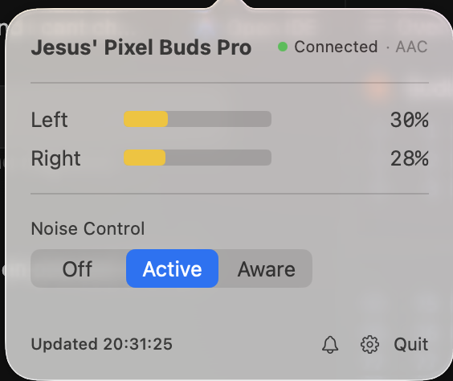
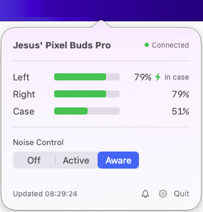
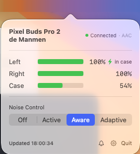
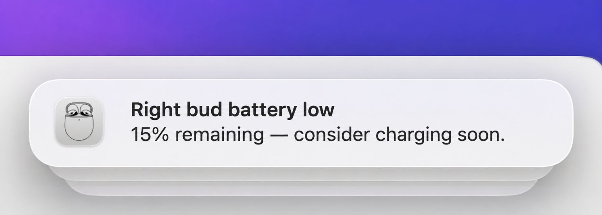
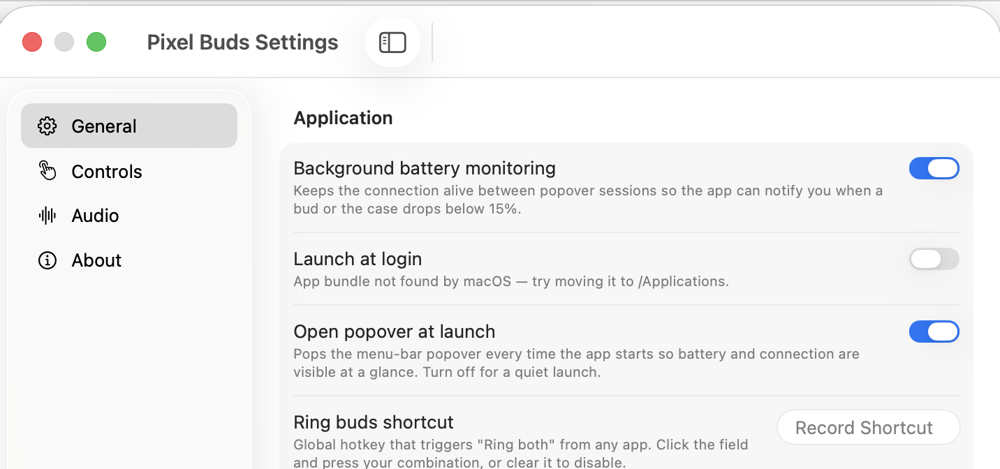
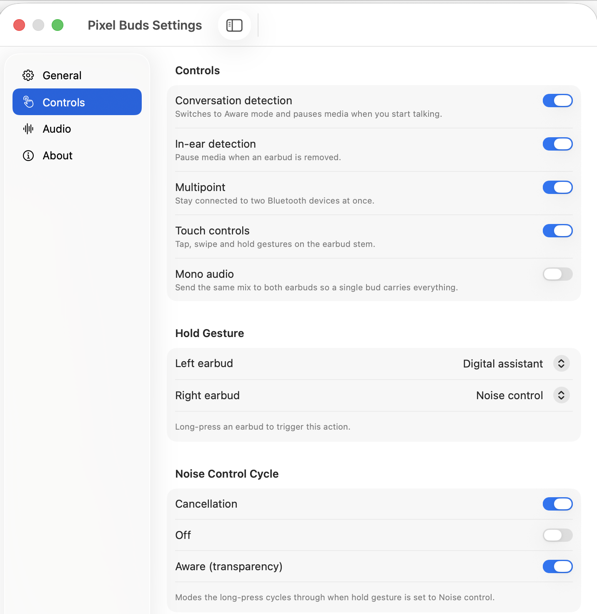
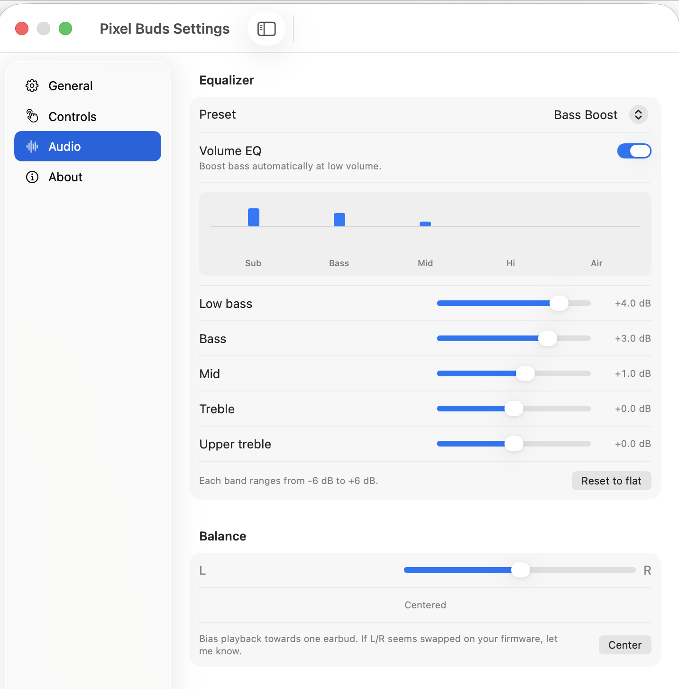

# PixelBudsMacOS

<p align="center">
  
</p>

A **native macOS menu-bar app** for Google Pixel Buds Pro (Gen 1 & Gen 2). No Electron, no
Chrome tab — talks to the buds directly over Bluetooth Classic RFCOMM using the
reverse-engineered Maestro/Pigweed RPC protocol, plus Google Fast Pair (GFPS) for
ring-my-buds.

## Screenshots

<table>
  <tr>
    <td align="center"><b>Gen 1 — charging in case</b></td>
    <td align="center"><b>Gen 2 — Adaptive ANC + case charging</b></td>
    <td align="center"><b>Battery alert</b></td>
  </tr>
  <tr>
    <td></td>
    <td></td>
    <td></td>
  </tr>
</table>

<table>
  <tr>
    <td align="center"><b>Settings — General</b></td>
    <td align="center"><b>Settings — Controls</b></td>
    <td align="center"><b>Settings — Equalizer &amp; Balance</b></td>
  </tr>
  <tr>
    <td></td>
    <td></td>
    <td></td>
  </tr>
</table>

## Features

**Menu bar popover** (one click on the icon):

- Live battery for both buds + the case, with charging (⚡) and in-case indicators.
- Noise Control toggle: **Off / Active / Aware** on Gen 1; adds **Adaptive** on Gen 2.
- "Find my buds" — rings left, right, both, or stops ringing.
- Audio codec label (AAC shown when streaming over A2DP).

**Settings window** (gear icon):

| Tab | What's inside |
|---|---|
| **General** | **Background battery monitoring** (keeps connection alive, notifies at ≤15 %), **Launch at login** (`SMAppService`), **Open popover at launch**, **Ring buds shortcut** (global hotkey — rings both buds from any app) |
| **Controls** | Conversation detection, in-ear detection, Multipoint, touch controls, mono audio |
| **Hold Gesture** | Per-ear long-press action (Noise Control ↔ Digital Assistant) |
| **Noise Control Cycle** | Which ANC modes the long-press cycles through |
| **Audio** | Volume EQ toggle, 5-band EQ (−6…+6 dB) with presets, L/R balance slider |
| **About** | Firmware versions + serial numbers per ear/case (copy-paste enabled) |

**Background monitoring** — optional; keeps the connection alive between popover sessions
and sends a macOS notification when a bud or case drops below 15 %.

## Requirements

- macOS 14 (Sonoma) or newer.
- Pixel Buds Pro **paired** with the Mac via System Settings → Bluetooth (pairing is not
  handled by the app).
- Pixel Buds Pro Gen 1 *or* Gen 2. Both models use CoD `0x240404`; Gen 2 is identified by
  its Bluetooth name starting with "Pixel Buds Pro 2". Adaptive ANC and a few other Gen-2
  features are hidden automatically on Gen 1.

> **Bluetooth permission.** On first launch macOS may ask for Bluetooth access. If the
> prompt doesn't appear, grant it manually: System Settings → Privacy & Security →
> Bluetooth → enable `PixelBudsBar.app`. Without it the app sees the buds as unpaired.

## Install

Download the latest `.dmg` from the [Releases](../../releases) page, open it, and drag
`PixelBudsBar.app` into `/Applications`.

For Launch-at-login to work, the app must be in `/Applications` — `SMAppService`
registration only works from well-known bundle-identifier locations.

## Build from source

```sh
git clone https://github.com/KashaMalaga/PixelBudsMacOS
cd PixelBudsMacOS
./Scripts/build-app.sh
open ./build/PixelBudsBar.app
```

The script:

1. Runs `swift build -c release --product PixelBudsBar`.
2. Assembles a proper `.app` bundle under `build/` — `Info.plist`, `LSUIElement=YES`
   (menu-bar only), an `.icns` from `Resources/PixelBudsBar/icon-source.png`, and a copy
   of the flat resources.
3. Ad-hoc codesigns the bundle so Gatekeeper lets it run.

> **Ad-hoc signing note.** With an ad-hoc signature macOS marks the Login Items entry as
> `requiresApproval` the first time. The app shows an orange banner with an "Open Login
> Items" button that deep-links to the right pane. Flip the system toggle once and it sticks.

## Other targets

The Swift package also ships two diagnostic CLIs that share the same protocol stack:

- **`BudsSpike`** — Phase 0 probe. Opens the Maestro RFCOMM channel and hex-dumps every
  byte received. Good for confirming pairing and Bluetooth permissions before involving the GUI.
- **`BudsRead`** — uses the full stack (HDLC → Pigweed RPC → protobuf) to read software
  info, runtime info, and ANC state, and emits a JSON snapshot. Useful for protocol debugging
  and verifying channel selection on Gen 2.

```sh
swift run BudsSpike
swift run BudsRead
```

## Tests

```sh
swift test
```

Covers HDLC framing round-trip, CRC, varint encoding, Pigweed RPC packet construction, and
decoding of real captured frames in `Reference/captured-frames-2026-05-16.txt`.

## What it does NOT do

- No telemetry, no analytics, no network connections to anything except the Sparkle update
  feed (which you can disable in `Info.plist`).
- No Google account login — settings are read/written directly from the buds' on-device
  storage over Bluetooth.
- No firmware updates. The Maestro protocol exposes them, but they're not implemented (high
  blast radius if something goes wrong, low value outside Google's official channel).
- No iOS / iPadOS support. `IOBluetooth`'s RFCOMM APIs are macOS-only.

## Privacy

The app reads and writes settings, and reads serial numbers and firmware versions, only from
your locally-paired buds over Bluetooth. Nothing leaves your Mac. There is no Google Fast Pair
account key registration either — GFPS is used only to send the Ring command over a local
RFCOMM channel.

## Acknowledgments

- Protocol details (Maestro proto + reverse-engineering notes) come from
  [qzed/pbpctrl](https://github.com/qzed/pbpctrl), the Linux equivalent of this app, which did
  the bulk of the hard work. Licensed Apache-2.0 / MIT.
- Google Fast Pair Message Stream
  [specification](https://developers.google.com/nearby/fast-pair/specifications/extensions/messagestream).

## Further reading

- [`ARCHITECTURE.md`](ARCHITECTURE.md) — protocol stack, module boundaries, connection lifecycle.
- [`AGENTS.md`](AGENTS.md) — conventions and recipes for AI-coding assistants working in this repo.
- [`Reference/README.md`](Reference/README.md) — upstream files and their licensing.
- [`docs/distribution-setup.md`](docs/distribution-setup.md) — how to set up Developer ID
  signing + notarization + Sparkle auto-updates for a release build.

## License

MIT — see [`LICENSE`](LICENSE).

Files under `Reference/` retain their original (Apache-2.0 / MIT) licensing from upstream.
